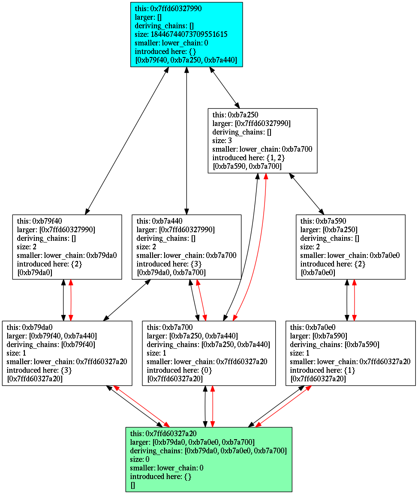

PosetOfSets
=======================================

This code implements a datastructure for a partially ordered set of sets in C++11.
Suppose you have sets of elements you could store them in a poset. It offers the advantage that you could quickly identify for any given set which are all the subsets and which are all the containing sets.

**Example**:
For example, if you have the following sets of integer values:
{3}, {2,3}, {0}, {0,3}, {0,1,2}, {1}, {1,2}
This information is captured in the following datastructure:

**Properties**:
- It is a directed acyclic graph whereby each node represents a set of subelements and whereby 1 node represents the empty set and 1 node represents the set with all possible subelements.
- Edges exist where there is a subset-relationship.
- The amount of edges is minimal, there are no redundant edges.
- A spanning tree is maintained (the red-colored edges) to keep track which set of subelements corresponds with each node (except the all-node).  Every edge of the spanning tree corresponds with the introduction of additional subelements. When following the path from an arbitrary node towards the empty node one can reconstruct the corresponding set of subelements.
- There is also a reverse lookup multimap to more efficiently track which nodes introduce a given subelement.
- The datastructure corresponds with a Hasse-diagram when the nodes for all possible combinations of subelements are added. In that case the diagram corresponds with a n-dimensional hypercube whereby n equals the amount of unique subelements.
- The nodes can be augmented with some useful payload.

**Observations**: After some experimentation (aka playing around) I made the following observations
- With completely random data the memory footprint of the datastructure does not scale well with the amount of unique subelements. One could expect to achieve some data-compression by taking advantage of the fact that many sets of subelements will overlap. But with each newly introduced node the spanning tree needs to be rearranged: some lower branches are terminated and their higher parts are connected to another stem. As a result subelements introduced by the lower parts of the spanning tree need to be introduced again in the modified branches. This smashed my hope to achieve data compression.
- It is cheap to list all nodes that contain a given set of subelements, and cheap to list all nodes that are subsets of a given set of subelements. It could be cheaper with a variant of this datastructure that uses a full chain decomposition (which has additional redundant edges?)

**TODO**: (but not an ambition of mine atm)
- Add operators to add nodes in function of an existing node. "I want the node corresponding with the elements from node X minus/plus subelements xyz."
- Add functionality to remove nodes.

